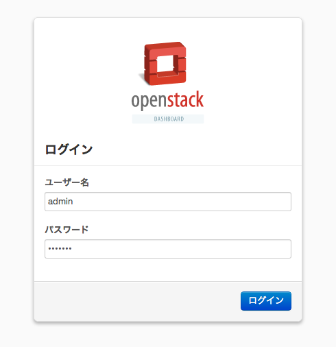
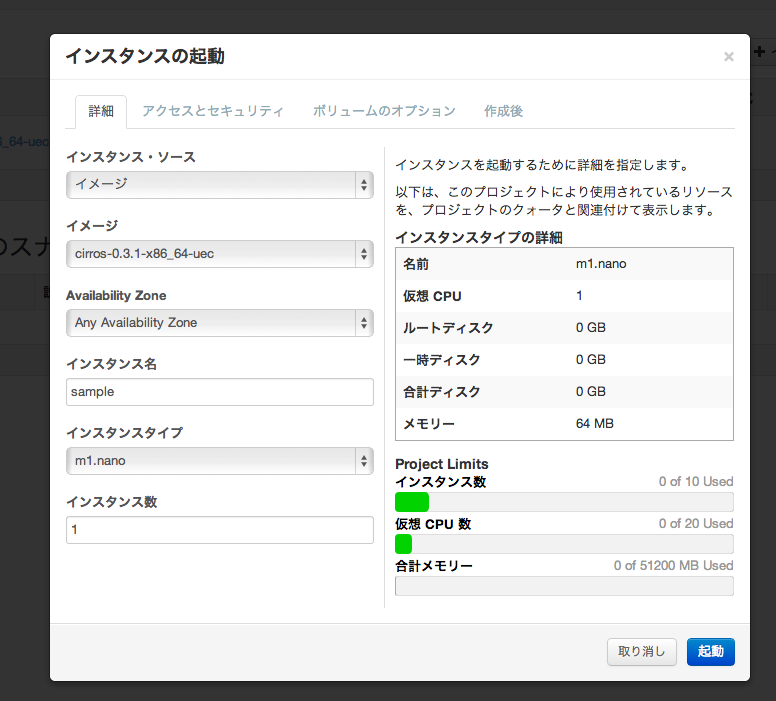
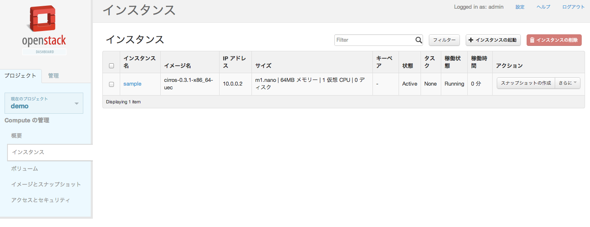
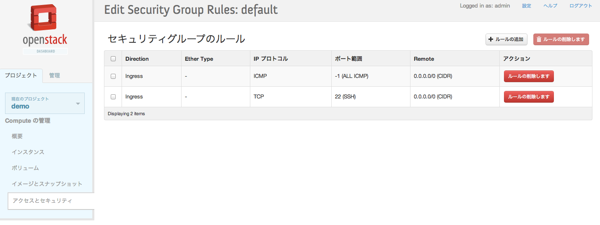

# 1つの仮想マシンの中にDevStackでオールインワンなOpenStack環境を作ってみる

DevStackを使用すると比較的簡単にOpenStack環境をデプロイできるんだそうです。  
今回はOpenStack環境を構築するのにデファクトになってるUbuntuを使います。  
これなら気軽に試せていいですね。

## スペック

- ホストマシン: MBA Mountain Lion
- CPU: Core i7
- 搭載メモリ: 8GB
- ディスク: SSD 512GB
- 仮想化ソフトウェア: VMware FUSION  
スナップショット取りやすくて開発に便利ですよ。
- 仮想マシン割り当てメモリ: 4GB
- 仮想マシンディスクサイズ: 80GB

## インストール

```
sudo apt-get -y update
sudo apt-get -y upgrade
```

以下のファイル用意。

```shell:openstack-kickstart.sh
#!/bin/sh
apt-get update || yum update -y
apt-get install -qqy git || yum install -y git
git clone https://github.com/openstack-dev/devstack.git
cd devstack
echo ADMIN_PASSWORD=password > localrc
echo MYSQL_PASSWORD=password >> localrc
echo RABBIT_PASSWORD=password >> localrc
echo SERVICE_PASSWORD=password >> localrc
echo SERVICE_TOKEN=tokentoken >> localrc
```

初期化します。

```
sudo sh openstack-kickstart.sh
```

実行します。  
一回目はものすごい時間かかるのでコーヒー飲んだり別のことをしています。

```
cd devstack
sudo ./stack.sh

(snip すごい時間かかる・・・)

Horizon is now available at http://172.16.12.152/
Keystone is serving at http://172.16.12.152:5000/v2.0/
Examples on using novaclient command line is in exercise.sh
The default users are: admin and demo
The password: password
This is your host ip: 172.16.12.152
stack.sh completed in 1978 seconds.
```

終わった模様。  
30分ぐらいか・・・。

## 動作確認

動作確認してみますか。

###　ログイン画面



ログイン直後では何もできない。

### インスタンス起動画面

なんかCentOSのEPELで見た時のより進化してる。



### インスタンス起動直後

稼働時間まで右に出るようになった。すごい。



ping飛ばしてみる。

```
stack@devstack01:/opt/stack/devstack$ ping 10.0.0.2
PING 10.0.0.2 (10.0.0.2) 56(84) bytes of data.
64 bytes from 10.0.0.2: icmp_req=1 ttl=64 time=1.64 ms
64 bytes from 10.0.0.2: icmp_req=2 ttl=64 time=0.438 ms
^C
--- 10.0.0.2 ping statistics ---
2 packets transmitted, 2 received, 0% packet loss, time 1001ms
rtt min/avg/max/mdev = 0.438/1.041/1.644/0.603 ms
```

OK。セキュリティグループ編集してフローティングIP当ててみる。



```
stack@devstack01:/opt/stack/devstack$ ping 172.24.4.225
PING 172.24.4.225 (172.24.4.225) 56(84) bytes of data.
64 bytes from 172.24.4.225: icmp_req=1 ttl=64 time=1.32 ms
64 bytes from 172.24.4.225: icmp_req=2 ttl=64 time=0.481 ms
^C
--- 172.24.4.225 ping statistics ---
2 packets transmitted, 2 received, 0% packet loss, time 1001ms
rtt min/avg/max/mdev = 0.481/0.903/1.326/0.423 ms
```

これもOK。  
SSHログインしてみる。

```
stack@devstack01:/opt/stack/devstack$ ssh cirros@172.24.4.225
The authenticity of host '172.24.4.225 (172.24.4.225)' can't be established.
RSA key fingerprint is 25:a6:81:e7:98:15:02:25:be:0d:3d:03:88:fa:92:48.
Are you sure you want to continue connecting (yes/no)? yes
Warning: Permanently added '172.24.4.225' (RSA) to the list of known hosts.
cirros@172.24.4.225's password: 
Permission denied, please try again.
cirros@172.24.4.225's password: 
$ ifconfig
eth0      Link encap:Ethernet  HWaddr FA:16:3E:3C:94:5E  
          inet addr:10.0.0.2  Bcast:10.0.0.255  Mask:255.255.255.0
          inet6 addr: fe80::f816:3eff:fe3c:945e/64 Scope:Link
          UP BROADCAST RUNNING MULTICAST  MTU:1500  Metric:1
          RX packets:246 errors:0 dropped:0 overruns:0 frame:0
          TX packets:258 errors:0 dropped:0 overruns:0 carrier:0
          collisions:0 txqueuelen:1000 
          RX bytes:32198 (31.4 KiB)  TX bytes:29421 (28.7 KiB)

lo        Link encap:Local Loopback  
          inet addr:127.0.0.1  Mask:255.0.0.0
          inet6 addr: ::1/128 Scope:Host
          UP LOOPBACK RUNNING  MTU:16436  Metric:1
          RX packets:0 errors:0 dropped:0 overruns:0 frame:0
          TX packets:0 errors:0 dropped:0 overruns:0 carrier:0
          collisions:0 txqueuelen:0 
          RX bytes:0 (0.0 B)  TX bytes:0 (0.0 B)

$ 

```

素晴らしい。  
VMの中にVMが立ち上がってる・・・。

## 参考リンク集

- [DevStack - Deploying OpenStack for Developers](http://devstack.org/)
- [openstack-dev/devstack](https://github.com/openstack-dev/devstack)
- [Single Machine Guide - DevStack](http://devstack.org/guides/single-vm.html)
- [「オープンソース」を使ってみよう (第23回 DevStackでラクラク導入！ OpenStackを使ってみよう編)](http://www.ospn.jp/press/20120828no27-useit-oss.html)
